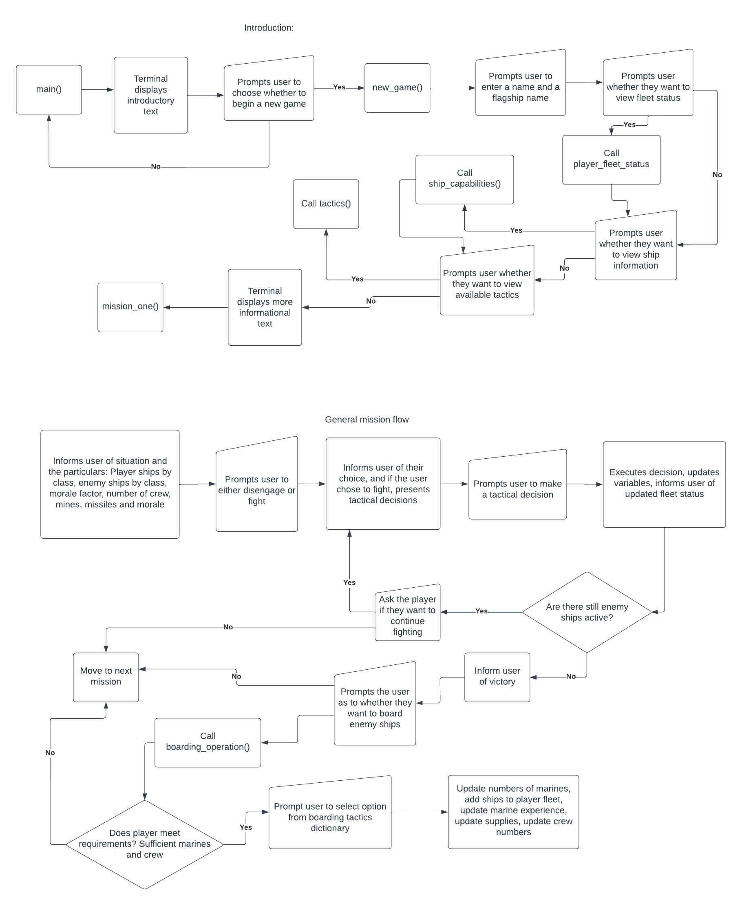

# Fleet Command

## Code Institute Python command line interface application

Am I responsive thing goes here

# Table of Contents
- [Background](#background)
- [Scope](#scope)
- [Audience](#audience)
- [User Stories](#user-stories)
- [Features](#features)
- [Function](#function)
- [Development Choices](#development-choices)
- [Flow Chart](#flow-chart)
- [Future Work](#fture-work)
- [Bugs](#bugs)
- [Technologies](#technologies)
- [Deployment](#deployment)
- [Testing](#testing)
    - [Function testing](#function-testing)
    - [Balance testing](#balance-testing)
    - [User story testing](#user-story-testing)
    - [PEP8 testing](#pep8-testing)
- [Credits](#credits)

# Background

When choosing video games to play, I find that I gravitate toward strategic wargames - titles like Command & Conquer, Homeworld, Panzer Corps, Wargame: Red Dragon, Distant Star: Revenant Fleet, Total War series, Hearts of Iron, XCOM and Company of Heroes. The one thing that ties these games together is that the developers have implemented various mechanics that mean that a player must consider the strategic layer when making decisions - things like supply lines, numbers of tanks and soldiers, resources, the movement of battlegroups and so on. This adds depth to a game that goes beyond tactical decisions - what targets to shoot, where tanks move and so on. 

I enjoy military science fiction books. In particular, I tend to select books where the authors consider the realities of war in their plots, paying heed to such things as tactics, strategy and logistics. Perhaps one of my most favourite series are the Lost Fleet books, authored by retired US Navy officer John Hemry, writing under the pen name Jack Campbell. As a former naval officer, Campbell is able to give a more realistic depiction than most other authors of how a military force considers tactics, strategy and logistics in operations.

The basic plot of the Lost Fleet books involves a 100-year long war between two large interstellar human civilisations - the Alliance, and the Syndicate Worlds. This war is fought primarily using large fleets of space-craft. Since both combatant factions are roughly equally matched in population and industrial output, neither can gain a decisive advantage over the other, leading to the war dragging on for a century. Predictably, casualties on both sides have been huge, and this has led to a problem - officers are often poorly trained, having been rushed through training in order to replace losses. This has in turn led to the militaries of both side being rather poorly led, with both sides often resorting to simplistic tactics that lead to bloodbaths, the officers of both sides not skilled or experienced enough to use more advanced tactics. Into this mess of a war comes the series' protagonist, Captain John Geary, a highly skilled pre-war officer placed in cryogenic stasis in an escape pod when his ship was destroyed in the first battle of the war. Geary assumes command of an Alliance fleet and, using his pre-war skills and knowledge of advanced tactics, inflicts crushing defeats on the Syndicate Worlds, eventually winning the war. 

The series as a whole contains detailed battle sequences that a reader can easily picture in their head. Beyond this, Campbell takes pains to consider the strategic and logistical implications of Geary's actions - food, fuel and ammunition levels are mentioned at length, and these have an effect on Geary's decisions - sometimes Geary is forced to use an unorthodox or risky approach simply because his fuel and ammunitions reserves are too low, or his ships are too damaged to do otherwise. 

This project is a homage of sorts to the Lost Fleet series. The project therefore is a text-based tactical decisions game run in the terminal, with some strategic elements planned. The player takes the role of an admiral who has been placed in command of a fleet of naval spaceships. The player's objective is to take these ships and defend the Alliance against a large Syndicate Worlds attack across multiple fronts. If the player is successful enough, and meets the victory criteria, they may be able to launch a counter-attack to take advantage of the enemy's losses.

# Scope

The scope of this project is to create a text-based naval battle simular game that is run in the terminal. Players will be given information via the terminal and then presented with decisions about how to proceed. They are then prompted to respond to these decisions via key-presses. These decisions are then handled buy the code and the results displayed the user. 

# Audience

The intended audience is fans of military science fiction and fans of tactical choice-based games. 

# User Stories

Users must be able to understand the situation presented by game. This will be achieved with strong inductory print statements.

Users must be well-informed by the text content of the game. This will be achieved with plenty of print statements with good informational text.

Users must be able to respond to prompting from the game by key-presses. This will be achieved with input statements and IF / ELSE statements that respond based on what has been entered by the user. 

Responses to input prompts must handle incorrect / invalid inputs gracefully. This will be achieved with While loops and Try / Except statements.

Users must be able to make informed tactical and strategic choices in the game. This will be achieved with each decision point having at least two ways of responding to it.   

Users must be able to meaningfully influence the outcome of the game. This will be achieved with users being able to lose and win based on their decisions. Making poor decisions should cause players to lose the game, whereas making good decisions should allow players to win the game. 

# Features

The Fleet Command game consists of a number of missions that the player must navigate. When the player starts the game, the player is prompted to enter their name and the name of their flagship. The player is then given asked whether they want to see the status of their fleet, whether they want to view the capabilities of their fleet's ships, and whether they want to see the tactics they can use in battle. These help inform the player as to the nature of the game and how to play it. 

Once these decisions have been resolved, the campaign begins. The campaign consists of 7 missions, with an 8th bonus mission that may be played if the player has done well enough in the main campaign. Each mission presents the player with a situation that is explained to the player. Each mission also contains a number of enemy ships. Each mission also contains choices using input statements. The first choice in each mission is whether or not to actually play the mission, which is usually framed as a decision on whether or not to engage the enemy ships in the mission. If the player chooses yes, the mission's narrative begins, and combat starts. If the player chooses no, the mission is skipped. This does not apply in mission 7, and this is explained below. Other missions have decisions that must be resolved before combat begins.   

If the player chooses to engage in combat, the number of enemy ships and the tactics that can be employed are printed. The player is then prompted to choose a tactic. There are 6 tactics that the player can choose to employ:
1 - attack 25% of the enemy
2 - attack 50% of the enemy
3 - attack 75% of the enemy
4 - attack 100% of the enemy
5 - attack 100% of the enemy with a long range missile barrage
6 - attack 100% of the enemy with a mine-field

Once the player chooses their approach, a series of calculations are performed, with the results printed. Firstly, the number of player ships is printed, so the player knows how many ships they will employ. Then, the number of turrets the player's ships have is printed, so that the player knows how much damage they can do. Next, the number of enemy ships the player will be facing is printed. If the player chooses to engage 50% of the enemy, then the number of enemy ships will be half of the starting enemy ships, rounded up. The number of turrets those enemy ships have is also printed, so that the player knows how much return fire they will face. 

Then the player is informed of how their fleet stacks up against the enemy ships - the differential in turrets, who has the advantage in combat power (more on this concept below), what percentage of the enemy ships are likely to be destroyed, and what percentage of the player's ships are likely to be destroyed. This prompts a further decision for the player to resolve - with this information, does the player want to proceed with their attack? If the player decides that they have a sufficient advantage, or that supply levels determine that they must launch their attack, then more calculations for performed, which determine how many player ships are destroyed and damaged and how many enemy ships are destroyed. The number of ships the player has lost, the number of ships remaining to the player, the number of enemy ships destroyed and the number of enemy ships that remain are then printed, so that the player can evaluate the results of their attack. The player is then given the choice of whether to end the battle, or to re-engage the enemy. If the player chooses to end the battle, mission continues. If no further decisions remain to be resolved in the mission, the mission ends and the next begins. If the player has knocked out all enemy ships, then the number of enemy ships destroyed and the number of player ships destroyed and damaged is printed. The number of supplies that have been salvaged from enemy ships is also printed. 

If all enemy ships have been destroyed, the player is then informed that they may board a small number of enemy ships. These are enemy ships that have been disabled, but are relatively intact, and may be added to the player's fleet provided the player can board, repair and crew them. If the player chooses to initiate a boarding operation, the numbers of ships that can be boarded is printed, along with the number of the player's Marines, crew and supplies. Marines are used to capture the ships, crew are used to re-crew them and add them to the fleet, and supplies are used to repair the ships. The choices that the player can take are then printed. The player can:
1 - board and capture a battleship
2 - board and capture a cruiser
3 - board and capture an escort
4 - board all remaining enemy ships
5 - stop boarding enemy ships and move on

If the player chooses options 1, 2 or 3, a number of Marines and crew will be consumed, 1 unit of supply will be subtracted from the player's total, and the ship will be added to the player's fleet. If the player chooses option 4, all remaining enemy ships will be boarded, provided the player has sufficient supplies, marines and crew to do so. If the player does not, the game prompts the player to try boarding the ships one at a time, as a certain number of Marines are needed for each ship, and a certain lower number will be returned. If the player chooses option 5, the boarding operation ends and the mission continues. Once the number of boardable ships has reached 0 or the player has stopped the boarding operation, the number of ships boarded and taken is printed, as is the number of Marines lost and supplies consumed. 

At the start of each mission, the player may inspect the status of their fleet. This informs the player of the particulars of their fleet - number of ships, supply status, crew numbers, Marine strength and the number of enemy ships that have been captured. If the player has aided other allied groups, the ships that they have provided are also printed, so that the player can be assured that the totals of their ships are correct. 

The missions of the game are designed to be unique. The missions are discussed below:
Mission 1 - this mission is the tutorial mission, and is designed to give players an introduction to all aspects of the game, but without consequences. The enemy group presented is small, and may be overcome by a few firing runs. It is small enough that the player should not suffer many losses if they choose to engage. It is also large enough that it will produce a few damaged ships that the player can board to experiment with the boarding operation functionality. If the player chooses to do so, they will not lose too many Marines, and will not gain too many ships, so they cannot gain a large advantage early on. 

Mission 2 - this mission is designed to test the player's experience that they gained in mission 1. The enemy group is large, and if handled incorrectly, can inflict heavy casualties on the player. 

Mission 3 - this mission contains more narrative elements, and takes place in the Osiris system. The enemy group has split into two parts. One part is engaging the defence forces of Osiris, and the other part is boarding the dockyards at Osiris. The player is given the choice of which group to engage first, with the outcomes of each hinted at. If the player aids the Osiris defence forces, the defence force ships will reinforce the player. If the player engages the dockyard group, they will be able to aid the dockyards with their Marines. The dockyards will then transfer additional supplies and Marines to the player. If the player engages both groups. They will gain a small bonus, getting a few more ships, Marines and supplies, and an additional missiles and mines sufficient for one use of each. 

Mission 4 - this mission is a straight fight, and the enemy group that the player may engage is very large. The player must apply their experience from the previous missions to win through. 

Mission 5 - this mission is another simple engagement against a large enemy group, but it has a twist. Firstly, the player must decide whether or not to help an allied convoy. If they choose yes, the player will expend supplies to repair the allied ships, but the ships will reinforce the player. Secondly, the enemy group that the player will face is very large. However, the fight can be made easier if the player has conserved their mines. If the player has mines remaining, a minefield will be laid at the point where the enemy group will arrive. If the player has 1 mine-fields' worth of mines, a standard mine-field will be laid, and the resultant enemy fleet will be reduced as if the projected enemy fleet had been attacked with tactic 6. If the player has two mine-fields' worth of mines, a double-density minefield will be laid, and the resultant enemy fleet will be reduced as if the projected enemy fleet had been attacked with two rounds of tactic 6. This can give the player a significant advantage. 

Mission 6 - this mission is more of a narrative mission, and takes place in the Laconia system. The enemy group is small, being a splinter of the enemy group from the last mission. It is beseiging the . The player should be able to overcome this group without too much difficulty. The player is then given a choice of whether or not to help out the ground forces of Laconia with the fleet's Marines. If the player chooses to do so, they will gain some additional Marines and supplies. The player is then given the choice of aiding the ships from Laconia that were disabled. If the player chooses to do, they will expend a number of supplies, but gain additional ships. 

Mission 7 - this is the last mission, and is a straight fight. However, the gimmick is that the mission cannot be skipped - the player must engage. Once the fight is done, the player's performance is checked against the victory conditions. There are 3 victory conditions - failure, partial victory and total victory. If the player meets the failure criteria or partial victory criteria, they are taken to the campaign report, which sums up the player's performance. If the player meets the total victory criteria, they are congratulated and given the choice of whether or not to launch the bonus mission. 

Bonus mission - this mission is only available to players who achieve a total victory, and it simulates an Alliance counter-attack on a Syndicate Worlds' system. The enemy is present in very large numbers. To compensate for these odds, the player's damaged ships are returned to them, and they are reinforced with other ships as well. The large battle should be a fitting conclusion to the campaign, and a fine test of the player's now well-honed skills. 

Campaign report - this isn't a mission, but is part of the narrative campaign. It sums up the player's performance, showing how many ships they started with, how many they lost damaged and destroyed, how many enemy ships they destroyed, how many enemy ships they captured, and other data. The player is then given a choice as to whether they want to restart the game, applying their experience to hopefully achieve a better outcome. 

# Function

The first function that called when the program begins is main, by tradition. Main contains a player decision to start the game. If the player chooses to begin the game, two functions are called - new_game_reset and new_game. New_game_reset resets the global dictionaries that are used in the game. This isn't necessary if the player is starting a new game from scratch, but is necessary if the player is starting a new game after either beating it or failing. New_game contains three calls to introductory functions - player_fleet_status, ship_capabilities and tactics. These inform first time players about the context of the game and how to play it. 

Each mission is handled with its own function. As each mission presents the player with a narrative and a group of enemy ships that must be overcome. A dictionary defining this group is the first task executed by each mission function. 

Each mission function then calls the enemy_firepower_calculator function, which is passed the dictionary containing the numbers of enemy ships. The enemy_firepower_calculator calculates the starting firepower of the enemy group and returns it to a variable called enemy_firepower. The value of the enemy_firepower variable and the dictionary containing the enemy group strength are then printed to the terminal along with some mission-specific story-telling text. This gives the user some context within which to make their decisions. The function then calls the player_firepower_calculator function, which functions similarly to the enemy_firepower_calculator. 

Each mission function then contains an input and a related IF / ELSE statement that asks if they want to engage the enemy group. If the player chooses not to engage, the mission ends and the next mission function is called.

However, if the player chooses to engage, the fight_battle function is called. This is the core mechanic of the game, and is what allows the game to simulate space combat. 

The fight_battle function contains the fight_engagement function, which is where the user actually makes tactical decisions. Firstly, the user is prompted to enter a number between 1 and 6 to select the tactic they want to use, which determines the number of enemy ships the player's fleet will face. The firepower rating of the number of enemy ships the player will face is then calculated using the calculate_effective_enemy_firepower function. The difference in firepower rating between the player's ships and the number of enemy ships that the player has chosen to engage is then calculated using the firepower_comparator function. This difference is called effective_firepower_difference

The fight_engagement function then calculated the combat power of the player's fleet and the enemy ships the player has chosen to face. These calculations are performed in the player_combat_power_calculator and effective_enemy_combat_power_calculator functions, with the values returned to the player_combat_power and effective_enemy_combat_power variables. The combat power is the square of the firepower rating. The difference between the two combat power values is calculated. 

The difference between the two combat power values is the calculated in the combat_power_difference_calculator function, with the output returned to the combat_power_difference. The difference that is used is the square root of the higher combat power subtract the lower combat power. 

Two variables are then calculated - firepower_factor and losses_factor. 

Firepower_factor is a measure of much damage the player can do in the firing run. It is calculated by dividing the combat_power_difference by the value of player_firepower, and produces a value between 0 and 1

Losses_factor is a measure of how much damage the enemy can do in the firing run. It is calculated by dividing the effective_enemy_firepower by the combat_power_difference, and then dividing that by 5. 

This only occurs is the player has a greater combat power than the enemy. If the enemy has a greater combat power, then the calculations are reversed. The firepower_factor is calculated by dividing the player_firepower by the combat_power_difference and then dividing that by 5. The losses_factor is calculated by dividing the combat_power_difference by the effective_enemy_firepower. If both the player and enemy have equal combat power values, then blanket values of 0.50 are used for both the firepower_factor and losses_factor. 

If the player selected tactic 5, a missile barrage, the firepower_factor variable is instead calculated by dividing the value of the missiles_fired variable by the value of the effective_enemy_firepower variable, which is intended to model the weapons of ships in the enemy group being used as point defence to shoot down the player's missiles. The more missiles the player is able to fire, or the smaller the number of ships the missiles are being used against, the better the saturation - more missiles are able to get through the point defences, and hence more enemy ships are destroyed. 

If the player selected tactic 6, a mine field, the firepower_factor variable is instead calculated by dividing the number of mines the player can lay by the number of ships in the enemy group, and then dividing this by 2. This models the mines not being able to destroy more ships than there are mines, and a reasonable assertion on my part that two mines are needed to destroy a ship. 

Two further variables are then calculated - the projected_enemy_destroyed and projected_player_losses variables. The player is then given the choice of whether to proceed or not, given the information and projected outcome. 

If they choose not to continue, then the fight_engagement function is called again, and the player may choose a different tactic. If they choose to proceed, then the update_enemy and update_player functions are called. These functions update the player_ships and enemy_group_strength dictionaries. 

The update_enemy function first calculates a variable called damage_factor, which multiplies the firepower_factor by the value of player_experience. If this value is greater than 1, then it is corrected to 1. This is done because damage_factor is directly used to calculate the number of enemy ships destroyed. If the damage_factor exceeds 1, then more enemy ships may be destroyed than were targeted or even present in the battle. 

The number of destroyed enemy ships is then used to update the enemy_group_strength, enemy_losses, enemy_local_losses and enemy_battle_losses dictionaries. If any of the values of enemy_group_strength are negative, then these are corrected to 0. This prevents enemy groups having negative numbers of enemy ships, which can badly mess up the calculations. The updated enemy_group_strength dictionary is then returned to the fight_engagement function. The enemy_battle_losses dictionary tracks the number of enemy_ships destroyed in that battle, and enemy_local_losses tracks the number of enemy_ships destroyed in that particular firing run. The enemy_losses dictionary tracks the total number of enemy ships destroyed by the player so far. 

The update_player function calculates the number of player ships that have been knocked out - meaning out of action, either damaged or destroyed. This is done using the losses_factor. The player_battle_losses dictionary tracks the number of ships destroyed in that battle. The values of the player_battle_losses dictionary are then split into the player_destroyed_ships and player_damaged_ships dictionaries. The number of Marines the player has are also updated, to reflect the ships that carry them being destroyed. The player_ships dictionary is the updated with the number of ships knocked out. If the number of player_ships falls to 1 or below, the value is corrected to 0. This is done because testing revealed that it was possible for the player to be reduced to 1 battleship and 1 cruiser, and then for these ships to never be destroyed, making it impossible for the player to lose the game. Also, if the player has been reduced to that many ships, they have basically lost anyway. The player_ships dictionary is then returned to fight_engagement. 

Once the firing run has been conducted, the results are printed, informing the player of how successful they were. The player_ships, player_local_losses, enemy_group_strength and enemy_local_losses dictonaries are printed. 1 unit of supply is also consumed, to represent the fuel and ammunitions used. 

A conditional check is then performed. If the player has been reduced to 0 ships of all tonnages, then the game ends, with some appropriately dramatic text printed. If the player has run out of supplies, then the game ends, as the player's fleet no longer has sufficient fuel and ammunition. 

If the enemy group still has ships in it, then the player is given the choice of whether or not to re-engage. If they choose to dis-engage, then the battle ends, and the player_total_damaged and player_total_destroyed dictionaries are updated with the numbers of player ships damaged and destroyed. The values of the enemy_battle_losses, player_battle_losses, player_damaged_ships and player_destroyed_ships dictionaries are then printed, which tells the player how well they did. Finally, the reset_battle_losses function is called, which resets the values of player_battle_losses, enemy_battle_losses, player_damaged_ships and player_destroyed ships to 0. 

If the player does choose to re-engage, then the fight_engagement function is called again. The player_total_damaged and player_total_destroyed dictionaries are updated with the numbers of player ships damaged and destroyed. The values of the enemy_battle_losses, player_battle_losses, player_damaged_ships and player_destroyed_ships dictionaries are then printed, which tells the player how well they did. Finally, the reset_battle_losses function is called, which resets the values of player_battle_losses, enemy_battle_losses, player_damaged_ships and player_destroyed ships to 0. 

If the enemy group has had all of its ships destroyed, then the battle ends in victory, and the same steps as above are executed. The player is also able to salvage some supplies from the wrecks of the enemy ships and the player's own destroyed ships. 

In addition, the player may choose to board disabled enemy ships. The numbers available are stored in the boardable_ships dictionary and are calculated from the starting number of enemy ships, which are held in the enemy_starting_ships dictionary.

If the player decides to do so, the boarding_operation function is called. First, the function checks to see whether there are any enemy ships left to board, though the first time this function is called, this check will always pass, since the boarding_operation function can only be called if there are enemy ships to board. This check only exists to break out of the loop once the player has run out of ships to board. 

If there are ships to board, the function uses two for loops to print the number of ships that can be boarded, and the choice of what ship to board. The player is then prompted to enter a number to select what ship they want to board. This triggers an if / elif statement. The appropriate statement will then check to see if there are any enemy ships of that class to board and if the player has enough marines to make the attempt. If either of these fail, the function ends. If the checks pass, the else statement will remove a ship from the boardable_ships dictionary and add it to the player_ships dictionary. The value of the marines variable will be reduced, to model the casualties the player's marines suffer in that boarding action, and the value of the player's supplies variable will also be reduced, to model the fuel, ammunition and repair supplies needed to get the ship back into a useable condition. In addition, the appropriate value of the minimum_crew dictionary will be subtracted from the value of the excess_crew variable to reflect the sailors that have been transferred from the player's ships to the captured ships in order to crew them. The boarding_operation function will then be called again, which is where the first conditional check may trigger. Once there are either no more ships left to board, no more marines or no more crew available, the mission ends, and the next mission is started. 

# Development choices

When I first had the idea for this project, I planned to use a Google Sheets spreadsheet and the gspread Python library, as is used in the Love Sandwiches walkthrough project. The idea was to store the numbers of player and enemy ships, ammunition levels, supply levels and other such data in multiple worksheets which would be accessed using the methods of the gspread library. However, I considered that, should I want to distribute the project to other uses, such as to friends or via LinkedIn, this could become problematic, as multiple users might be pulling data from and sending data to the same spreadsheet at the same time, potentially breaking their games. 

As a result, I decided to store all data used in the game (ship numbers, firepower ratings, etc) in the run.py file itself. When creating this data, I decided to use Python dictionaries to hold related data - the numbers of player ships are held in a dictionary, ship firepower ratings are held in another, and the numbers of ships in enemy groups are held in their own dictionaries. This decision was made for two reasons. First, dictionaries allow the data to be grouped sematically in the code, which increases readability. Secondly, storing each data point as a simple variable seemed too easy, and I used simple variables extensively in my JavaScript Project. I wanted to use this project to practice my ability to use and interact with Python data structures. Using dictionaries also allowed me to use For Loops to quickly print out the key - value pairs of dictionaries to update the user with battle results. I was particularly keen to use For Loops as I have, until now, never been particularly comfortable using them, and I did not use them in the JavaScript project, which was noted in the project feedback received on 27/4/22. 

Many of the variables and dictionaries used in this project have been given global scope, with functions using the global keyword used to update these variables and dictionaries. I chose this approach because the project requires many variables to be passed between functions. Passing fewer arguments to function calls seemed to reduce complexity and improve readability during development. 

Early on in development, I realised that the project was probably being too ambitious in scope, so I reduced the classes of ships from 5 (battleships, battlecruisers, heavy cruisers, light cruisers and destroyers) down to 3 (battleships, cruisers, escorts).
I also removed references to marines, crew, missiles and mines, instead focusing on getting the core mechanics of the game working, with a view to implementing these later if time permitted.  

In the update_enemy function, the math.ceil method was used so that enemy ship losses were consistently rounded up rather than down, as I foresaw endless rounding down causing battles to go on for far longer than they needed to, potentially driving a user to boredom. The actual difference in firepower is minimal. 

The decision to use 2 functions to update the enemy_group_strength, enemy_losses, player_ships and player_losses dictionaries was taken when I realised that the fight_engagement function had become very large, with much repetition. 

The decision to refactor the fight_engagement function so that the firepower_factor and losses_factor variables were calculated dynamically rather than being static depending on tactic and the value of the effective_firepower_difference variable was taken when I realised that adding IF / ELIF statements to capture a sufficient number of situations would make the function very large and difficult to tweak. The dynamic calculation solution using Lanchester's Square Law is both smaller and far more elegant, with only the bare minimum of repetition. The dynamic calculation approach also models an engagement more realistically - when one side possesses overwhelming strength in numbers or firepower, it suffers very few casualties because enemy firepower is spread out over a large number of targets. When numbers are more even, the player suffers more casualties, which is an incentive to the player to whittle down the enemy numbers before 'going in for the kill', so to speak. 

When implementing the concept of experience through the player_experience variable and modification of the update_enemy function, I initially considered two methods of adding experience. The first method mimicked the method employed in many modern Role Playing Games such as the Fallout series, where each action, no matter how small, gives experience - picking a lock gains might give 10XP, whereas persuading a merchant to lower their prices might give 50XP. In Fleet Command, this method would add 0.01 to the player_experience variable each time the player decided to conduct a firing run, i.e. each time the fight_engagement was called. This would give the player's crews a small amount of experience each time they clashed with the enemy. The second method mimicked the method used in table-top roleplay games and wargames such as Dungeons & Dragons, where each player is awarded a set amount of experience points when a quest is completed, no matter what actions each player did. In Fleet Command, this method would add a flat value of 0.1 to the player_experience variable each time they decide to fight an enemy group via the fight_battle function, no matter how many times they engage via the fight_engagement function. Put simply - if the player fights, they gain experience. 

Ultimately, I went with the second method, as the first method would create an incentive for the player to always engage with option 1 - the safest approach. This would quickly bore a player, and could lead to players becoming overpowered by virtue of conducting many firing runs. I also considered that any kind of experience in any field is often not gained in the heat of the moment, but only after a period of analysis and reflection, when new procedures, processes, doctrines and so on can be developed and implemented. 

I implemented the concept of experience as a way of balancing out the player's losses - when they fight, losses are pretty much inevitable due to the calculations, but the experience gained by the player's crews counters this. 

Toward the end of the project, testing revealed that player_experience was having an outsized effect on the outcome of the game, particularly toward the end of the game. To compensate, I reduced experience gains from + 0.1 per mission to + 0.03 per mission. The former method was far too overpowered, akin to the player's ships growing new turrets!

I decided to implement the boarding mechanic as another way of balancing out the player's losses, and to add flavour and additional choices to the game for the player to consider. I added the option to board all enemy ships at once when I noted that after the battle in the second mission, the calculations returned 16 enemy ships that could be boarded, which would be a boring slog for the player to board one after another. I added the option to abandon the boarding operation when I noted that a player might like to focus on adding certain ships to their fleet. 

When working on commit #60, which overhauled the update_player function so that Marines are lost when the player's cruisers and battleships are damaged or destroyed, I chose for:
A battleship to lose 20% of its 40 Marines when destroyed
A battleship to lose 10% of its 40 Marines when damaged
A cruiser to lose 30% of its 20 Marines when destroyed
A cruiser to lose 20% of its 20 Marines when damaged

I chose these values because Marines in the Lost Fleet setting wear vacuum rated combat armour that offers excellent personal protection. I considered that some of a capital ships' Marines would be lost, but that a considerable majority would survive and be rescued thanks to their armour. 

Towards the end of the project's development, I decided to tackle the numerous formatting errors that had cropped up. Since the project contains many long strings of text that help inform the player, reformatting was challenging. 

For function calls with several arguments, I placed all of the arguments onto indented new lines

For inputs assigned to variables, I used the backslash character to place the continuation text onto new lines

For strings, I tried several methods, such as string concatenation, but I ran into under-indentation and over-indentation errors. I found that indenting one tab and 2 spaces or 6 spaces solved this, but then noted that mixing spaces and tabs is not allowed in Python. This also produced very messy code. I eventually resorted to shortening my print statements so that none went over 79 characters. Whilst initially annoying, after a while I determined that I had probably been too verbose with my text. Reducing line lengths forced me to be clearer and more concise. 

During development, I chose to use longer commit messages rather than shorter ones, as feedback from my JavaScript and Front-end projects noted that my commit messages there had been too short. Whilst the commit messages in this project may be longer than 50 characters, I considered this to be better and more descriptive than shorter, potentially less descriptive messages. 

# Flow Chart

A flow chart for the logic of this project was created using LucidChart. This helped map out how the game should work, and also provides a visual companion to the code description in the function section. 

# Future Work

As the project is a game, it has excellent scope for future work, much like commercial games may be improved with Downloadable Content. This should be relatively simple, since the core mechanics that simulate firing runs and boarding operations is in place, and more content would come in the form of additional missions.

As noted elsewhere, I initially struggled with properly simulating a space battle mathematically. I considered implementing some of sort of armour rating or shield rating function, which would reduce incoming damage, but ultimately the mathematics proved too difficult to implement. The armour rating / shield rating function could provide a threshold which incoming fire must over-match in order to be effective. If incoming fire cannot break armour or shields, then very little damage is sustained. However, if the incoming fire can break the armour or shields, then the effect could be devastating. This would probably function similarly to the Damage Threshold function in Fallout: New Vegas. 

I also considered implementing many more tactics than were present in the final version of the game. More tactics that change not just how many enemy ships the player targets but also *what* they target as well could be a good addition. For example, if the player chooses to ignore an enemy group's capital ships and instead try to focus on stripping off their escorts, then on subsequent firing runs the player could gain an advantage, as the enemy would not have enough escorts to stop the players escorts from swarming in. 

The game also models a very stupid enemy, who does not react to the player's actions. If the player chooses to target only 25% of the enemy group, the enemy does not try to counter that, whereas a human commander would. Also, if the player decides to skip a mission, the enemy has no say in that. In reality an enemy would try to engage the player if they wanted to do so. This also applies if the player wants to end a battle early. If the player chooses to do this, then the enemy cannot force the issue and re-engage. 

At the start of the project, I considered implementing some sort of random number generator and using random numbers for things in the game. Most obviously, this would be things like combat losses, where random numbers could indicate unexpectedly effective or ineffective firing runs. Early versions of the code did import the randint library in expectation of this, but other problems demanded my attention and I never got around to properly exploring how I could use random numbers. 

I also considered implementing specialised ship classes as well, such as mine-laying vessels and missile ships. These would have limited conventional firepower, but would carry large stocks of mines and missiles. These could increase the number of mine-fields and missile volleys available to the player, or could enhance the odds when these tactics are used.  

Though the core mechanics are in place, I cannot rule out further changes should I come across a superior method of mathematically simulating an engagement. Indeed, the implementation of Lancester's Square Law is fairly basic, as the actual model uses differential equations and considers the time over which a battle takes place as well. 

# Bugs

Early on in development, as I was focused on getting the core mechanics of the game working, I left out data validation when constructing the IF / ELSE conditional statements. During testing, this led to failures when I accidentally pressed the wrong keys. Once the major development work had been completed, with the mission functions written and the combat calculations properly implemented, I went back over the project implementing input validation using while loops with break statements, and try / except statements.  

Commit #23 added functionality to the update_player_ships to check if the calculations had returned negative values, and if so, to correct these to 0, since you cannot have a negative number of ships. If the player ran out of ships, i.e. they were all destroyed in a loop of the fight_engagement function, an IF statment added at the end of the fight_engagement function displayed a series of messages saying that the player had failed, and offered to restart the game. This actually caused a failure, since the new_game function was called, which required a player_name argument to be passed in. Since the player_name variable was not present in the fight_engagement function, the code failed. I decided to commit anyway, so as to dedicate the next commit to fixing the problem and hence adhere to best practices to keep commits atomic. Hence, the code contained in commit #23 will not work. Commit #24 fixed the bug by reworking the main and new_game functions. 

Commit #34 added the boarding mechanic, which allows players to board enemy ships after a battle has been won and add them to their fleet. Testing this mechanic with the first mission revealed that, whilst the player_ships dictionary updates properly, the player_firepower variable does not, since the value of player_firepower is calculated when the program runs for the first time, and is not updated. Further testing revealed that the value of player_firepower stays constant even when the player loses ships as a result of the fight_engagement / update_player loop. Commit #35 fixed this problem by using a new function called calculate_player_firepower to calculate the value of player_firepower dynamically. This function is called in the player_fleet_status function and at the start of the fight_engagement function.

Commit #39 broke the code due to insufficient testing. I removed the globl total_crew and excess_crew dictionaries without modifying the code in the calculate_total_crew and calculate_excess_crew functions. Commit #40 fixed this by adding those dictionaries back in, as well as adding the consideration of crew to the boarding mechanic. 

During some routine testing related to commit #44, I noted that when the battle in mission two was fought, it was possible for the enemy group to possess a negative number of enemy ships. I suspect that this is related to the player_experience modifier that increases the damage done by the player's ships in the update_enemy function. Commit #44 was dedicated to overhauling the boarding_operation function, so this bug was merely documented for later fixing. Commit #45 fixed this bug by appropriating the code used in the update_player function to solve a similar bug whereby the player could end up with a negative number of ships. This solution checks to see if the number of enemy ships of a specific class is less than 0, and if so, sets the number to 0. 

During testing related to commit #46, it was noted that when the game is failed and the option to start a new game is selected, the global dictionaries do not reset. Commit #46 was focussed on reworking the way in which the player's losses are calculated by adding the concept of damaged ships that will be repaired behind the lines and eventually returned to the player's fleet. This issue of dictionaries resetting is documented here, and will be dealt with in a future commit. 

During testing related to commit #49, which implemented the new_game_reset function, I was deliberately trying to lose the game in order to test that the new function was working as intended. To lose, I choose option 4 - the riskiest and most casualty heavy approach. I noted that the when the enemy ships outnumbered the player's ships, the firepower_factor variable was negative. This produced negative enemy loss values and negative player loss values, which had the effect of *adding* ships to the enemy and player fleets. This will require some reworking of the calculations.  

Testing various solutions to this problem also revealed another bug - the calculation results for selecting tactic 4 when facing enemy_group_two in Mission Two were unexpectedly bad for the player. The player's firepower_factor was calculated as 0.34 or thereabouts, whereas the losses_factor was calculated as 0.56 or thereabouts, despite the player having more ships than the enemy, which would lead to a reasonable expectation of destroying more ships than they lose. The cause of this was the losses_factor calculation, and the result was a consequence of the value of the effective_enemy_firepower (1040) being greater than the value of effective_firepower_difference (610). 

The solution to this calculation problem was found in Lanchester's Square Law, which is a concept that helps mathematically model a battle in which one side possesses more 'combat power' than the other, either through superior numbers, technology, training, etc. Combat power is essentially a measure of how much damage both combatants can dish out in a given time. It shows that when one combatant possesses superior combat power, the result is lopsided, with the superior combatant suffering far fewer casualties than might be expected. With this approach, the values of player_firepower and effective_enemy_firepower are squared and then square root of the difference between them is calculated. This solved the problem of the results of tactic 4 being bad for the player. 

Whilst useful, the application of Lanchester's Square Law did not solve the problem encountered when the player is facing an effective enemy strength that is greater than their own fleet strength, and in fact made it worse. Where before the calculations would technically work, even though they produced strange results, the calculations with the Square Law gave ValueErrors, since the square root function was being performed on negative numbers.

This problem was solved by reworking the fight_engagement function so that the firepower_factor and losses_factor are calculated differently if the player is outnumbered during a firing run (i.e. they choose to engage superior enemy numbers). If the enemy outnumbers the player in a firing run, the calculations are effectively switched around - the firepower_factor is calculated using the original losses_factor equation and the losses_factor is calculated using the original firepower_factor calculation. This gives the enemy an advantage, and so they will destroy more of the player's ships and lose fewer of their ships. 

During some routine testing, it was noted that the player_fleet_status function works properly, but can give misleading information when called. I noticed that when viewing the fleet status before beginning mission 2 after losing 1 cruiser and 5 escorts in mission 1 and also boarding 2 escorts and 1 cruiser that the function displayed that the fleet had 20 battleships, 50 cruisers and 147 escorts, but was also displaying that 1 cruiser and 3 escorts had been destroyed and that 2 escorts had been damaged. This could cause players to lose confidence in the game and to think that the game was not properly tracking their fleet status. 

I attempted to solve this by creating a salvaged_ships dictionary, which is updated in the boarding_operation function, and which tracks how many ships the player has salvaged and added to their fleet, and then using a loop to display the values of this dictionary in the player_fleet_status function. However, testing this solution revealed that option 5 - the option to board all enemy ships at once - was not working properly, as it was not properly updating the dictionaries. 
Further inspection of the code in the boarding_operation function revealed the answer as to why - when updating the escort key in the boarded_ships and salvaged_ships dictionaries, I had accidentally set the number of escorts to be increased by the number of cruisers.  

It was also noted that the number of the player's marines does not update based on how many ships they have lost - as ships are destroyed or damaged, the player would expect their marine strength to go down. This was fixed with some additional code in the update_player function that subtracts marines if any of the player's battleships or cruisers are destroyed. 

It was also noted that the enemy_battle_losses dictionary that is printed at the end of a battle now no longer contains the correct values. I initially put this down to the effect of the new approach to the calculation of the firepower_factor variable from the application of Lanchester's Square Law, but this was not the case. 

Investigation of this bug revealed that the source was the modifier applied to the three update_enemy calculations by the player_experience variable. This was determined when the game was played twice. The first time, I skipped the first mission, thereby not increasing the player_experience variable, and hence effectively not applying the modifier in the calculations for the second mission. In the second mission, the calculations produced results that were expected - I could not destroy more ships than I engaged. The second time, I played the first mission, thereby increasing the player_experience variable and applying a +10% modifier to the update_enemy calculations. With this modifier, I was able to destroy more ships than I engaged, confirming the existence of the bug. 
The player_experience modifier was effectively increasing the value of the firepower_factor variable, in some cases taking it above 1. Since the firepower_factor is used in the calculations directly, if it rises above a value of 1, then more enemy ships can be destroyed than exist. 

To solve this bug, I initially considered moving the application of player_experience from the update_enemy function to the fight_engagement function, using it to modify the value of firepower_factor there before passing firepower_factor to update_enemy
However, since there are 6 tactics and three calculations for determining the value of firepower_factor in each (depending on the values of player and enemy combat power) this would require at least 6 and possibly 18 additions to modify the value of firepower_factor. This seemed excessive and a violation of DRY principles. 

I then realised that I had dealt with a similar issue before, when writing the calculations for tactics 5 and 6, the missile barrage and mine-field tactics. In those cases, when firing many missiles or laying many mines from many ships against a small number of enemy ships, it was sometimes possible for the firepower_factor calculated there to be greater than 1. In those cases, I thought of this as being unrealistic, and the equivalent to destroying more ships than you have missiles or mines. Hence, I applied a small conditional check that checks to see if the value of firepower_factor is greater than 1, and if so, correct firepower_factor to 1. This is similar to the conditional checks in update_enemy and update_player, which check to see if the player_ships and enemy_group_strength dictionaries have negative numbers of ships, and if so, correct these to 0. 

Hence, I decided to create a new variable in update_enemy called damage_factor, which multiplies the passed value of firepower_factor and player_experience together. A conditional check checks to see if the value of damage_factor is greater than 1 and if so, corrects it to 1. The damage_factor is then used in the calculations where firepower_factor and player_experience were. This solution worked and had the desired effect of not being able to destroy more enemy ships than are present. 

As the project was nearing completion, testing of the many user input decisions was undertaken. Several bugs were noted, mostly input statements requiring input validation and needing new line commands. These were noted but not fixed during the commit that added the testing and results.

Balance testing was also undertaken as the project neared completion. This tested the calculations that underpinned the project to determine. The first 4 tests each tested scenarios in which the player exclusively turned to one conventional tactic - tactics 1, 2, 3 and 4. When exclusively using tactic 1, I was just about able to win the game and the bonus mission without running out of supplies, though this took a long time to do. From these tests, I determined that I needed to severely reduce the level of supplies that the player begins with, perhaps to a level of around 30 to 40, and that I needed to tweak the way in which the calculations in the update_player function are performed, and perhaps include conditional checks that watch for very low numbers of player ships. 

When using tactics 2, 3 and 4, I expected to lose the game due to heavy casualties. However, this was not the case. After several missions in which various levels of casualties were taken, I was reduced to 1 battleship and 1 cruiser. From there on, these last two ships proved impossible to lose. I determined that this was due to the calculations, which use the math.floor rounding method. The justification for this was that I wanted to model the superior armour and shields that battleships and cruisers carry, allowing them increased durability. The math.floor method rounds the number of player ships that the player would lose to 0, essentially making the player invulnerable.  

# Technologies

[Github](https://github.com/) was used to host the project repository.

[Gitpod](https://gitpod.io/) was used to create and edit the project files. The Preview Browser proved useful in seeing the results of minor changes.

[Slack](https://slack.com/intl/en-gb/) was used to hold video calls with my Mentor, Ronan McLelland, and discuss the direction of the project and its features.

[LucidChart](https://www.lucidchart.com/) was used to plan out the logic flow for the project's functions

[Heroku](https://www.heroku.com/) was used to deploy the project

# Deployment

As the project was nearing completion, Heroku and Github suffered security breaches, forcing Heroku to suspend the feature that allows direct linkage to a Github repository for deployment. 

# Testing

As Fleet Command is a tactical choice-based game that relies heavily on user input, it must be thoroughly tested to ensure that there are no errors that could cause a crash. 

The game must also be balanced, to ensure that a player can both win and lose the game based on their choices. The player cannot just stick to one option when fighting battles. Players who pick tactics 3 or 4 (the riskiest, most casualty-heavy, but quickest approaches) must run out of ships quickly. Players who rely on tactics 1 and 2 (the safer, slower approaches) must run out of supplies. 

## Function testing

This section covers the testing of the basic functionality of the game. Does it work as intended? Does it respond to player inputs? How does it handle incorrect / invalid inputs?

I have chosen to hold the result of this testing in a markdown table. Column 1 is the mission or feature in which the choice takes place. Column 2 is the choice itself. Column 3 is the response to the choice. Column 4 is the outcome. 

Main and new game functions
Choice                 | Response                      | Expected Outcome                               | Actual Outcome                                 |
-----------------------| ----------------------------- | ---------------------------------------------- | -----------------------------------------------|
Start new game         | Yes - key press y             | Start new game - enter username prompt         | Start new game - enter username prompt         |
Start new game         | No - key press n              | Loop back through main function                | Loop back through main function                |
Start new game         | Invalid - key press != y or n | Restate input prompt                           | Restate input prompt                           |
Enter player name      | Enter 'Adam'                  | Prints 'Good Morning Admiral Adam'             | Prints 'Good Morning Admiral Adam'             |
Enter flagship name    | Enter 'Dragon'                | Prints 'Welcome aboard the Battleship 'Dragon' | Prints 'Welcome aboard the Battleship 'Dragon' |
See fleet status       | Yes - key press y             | View player ships, marines, supplies and crew  | View player ships, marines, supplies and crew  |
See fleet status       | No - key press n              | Prompt fleet capabilities decision             | Prompt fleet capabilities decision             |
See fleet status       | Invalid - key press != y or n | Restate input prompt                           | Restate input prompt                           |
See fleet capabilities | Yes - key press y             | View capabilities of player ships              | View capabilities of player ships              |
See fleet capabilities | No - key press n              | Prompt tactics decision                        | Prompt tactics decision                        |
See fleet capabilities | Invalid - key press != y or n | Restate input prompt                           | Restate input prompt                           |
See tactics            | Yes - key press y             | See tactics player can employ in battle        | See tactics player can employ in battle        |
See tactics            | No - key press n              | Begin mission 1, stop at engage decision       | Begin mission 1, stop at engage decision       |
See tactics            | Invalid - key press != y or n | Restate input prompt                           | Restate input prompt                           |

M1
Choice                 | Response                      | Expected Outcome                                       | Actual Outcome                                         |
-----------------------| ----------------------------- | ------------------------------------------------------ | -------------------------------------------------------|
Engage / disengage     | Engage - key press y          | Launch fight_battle function, stop at tactic selection | Launch fight_battle function, stop at tactic selection |
Engage / disengage     | Disengage - key press n       | Launch mission 2, stop at fleet status decision        | Launch mission 2, stop at fleet status decision        |
Engage / disengage     | Invalid - key press != y or n | Restate input prompt                                   | Restate input prompt                                   |

M2
Choice                 | Response                      | Expected Outcome                                       | Actual Outcome                                               |
-----------------------| ----------------------------- | ------------------------------------------------------ | -------------------------------------------------------------|
See fleet status       | Yes - key press y             | View player ships, marines, supplies and crew          | View player ships, marines, supplies and crew                |
See fleet status       | No - key press n              | Proceed to mission narrative, stop at engage decision  | Proceed to mission narrative, stop at engage decision        |
See fleet status       | Invalid - key press != y or n | Restate input prompt                                   | Restate input prompt                                         |
Engage / disengage     | Engage - key press y          | Launch fight_battle function, stop at tactic selection | Launch fight_battle function, stop at tactic selection       |
Engage / disengage     | Disengage - key press n       | Launch mission 3, stop at fleet status decision        | Launch mission three, stop at fleet status decision          |
Engage / disengage     | Invalid - key press != y or n | Restate input prompt                                   | Restate input prompt                                         |

M3
Choice                 | Response                      | Expected Outcome                                                        | Actual Outcome                                                           |
-----------------------| ----------------------------- | ----------------------------------------------------------------------- | -------------------------------------------------------------------------|
See fleet status       | Yes - key press y             | View player ships, marines, supplies and crew                           | View player ships, marines, supplies and crew                            |
See fleet status       | No - key press n              | Proceed to mission narrative, stop at decision on which group to engage | Proceed to mission narrative, stop at decision on which group to engage  |
See fleet status       | Invalid - key press != y or n | Restate input prompt                                                    | Restate input prompt                                                     |
Engage / disengage     | Engage - key press y          | Proceed to mission narrative, stop at decision on which group to engage | Proceed to mission narrative, stop at decision on which group to engage  |
Engage / disengage     | Disengage - key press n       | Launch mission four, stop at fleet status decision                      | Launch mission four, stop a fleet status decision                        | 
Engage / disengage     | Invalid - key press != y or n | Restate input prompt                                                    | Restate input prompt                                                     |
Which group to engage  | key press 1                   | Engage sub-group 1                                                      | Engage sub-group 1                                                       |
Which group to engage  | key press 2                   | Engage sub-group 2                                                      | Engage sub-group 2                                                       |
Which group to engage  | Invalid - key press != 1 or 2 | Restate input prompt                                                    | Restate input prompt                                                     |

M4
Choice                     | Response                      | Expected Outcome                                                       | Actual Outcome                                                         |
---------------------------| ----------------------------- | ---------------------------------------------------------------------- | -----------------------------------------------------------------------|
See fleet status           | Yes - key press y             | View player ships, marines, supplies and crew                          | View player ships, marines, supplies and crew                          |
See fleet status           | No - key press n              | Proceed to mission narrative, stop at engage decision                  | Proceed to mission narrative, stop at engage decision                  |
See fleet status           | Invalid - key press != y or n | Restate input prompt                                                   | Restate input prompt                                                   |
Engage / disengage         | Engage - key press y          | Launch fight_battle function, stop at tactic selection                 | Launch fight_battle function, stop at tactic selection                 |
Engage / disengage         | Disengage - key press n       | Launch mission five, stop at fleet status decision                     | Launch mission five, stop at fleet status decision                     |
Engage / disengage         | Invalid - key press != y or n | Restate input prompt                                                   | Restate input prompt                                                   |
Trade sailors for supplies | Yes - key press y             | Add supplies, remove crew - must be inspected at start of next mission | Add supplies, remove crew - must be inspected at start of next mission |
Trade sailors for supplies | No - key press n              | Move to next mission                                                   | Move to next mission                                                   |
Trade sailors for supplies | Invalid - key press != y or n | Restate input prompt                                                   | Restate input prompt                                                   |

M5
Choice                 | Response                      | Expected Outcome                                       | Actual Outcome                                         |
-----------------------| ----------------------------- | ------------------------------------------------------ | -------------------------------------------------------|
See fleet status       | Yes - key press y             | View player ships, marines, supplies and crew          | View player ships, marines, supplies and crew          |
See fleet status       | No - key press n              | Proceed to mission narrative, stop at join-up decision | Proceed to mission narrative, stop at join-up decision |
See fleet status       | Invalid - key press != y or n | Restate input prompt                                   | Restate input prompt                                   |
Join-up decision       | Yes - key press y             | Add ships to player fleet, reduce supplies             | Add ships to player fleet, reduce supplies             |
Join-up decision       | No - key press n              | No reinforcements, proceed to engage decision          | No reinforcements, proceed to engage decision          |
Join-up decision       | Invalid - key press != y or n | Restate input prompt                                   | Restate input prompt                                   |
Engage / disengage     | Engage - key press y          | Launch fight_battle function, stop at tactic selection | Launch fight_battle function, stop at tactic selection |
Engage / disengage     | Disengage - key press n       | Launch mission six, stop a fleet status decision       | Launch mission six, stop a fleet status decision       |
Engage / disengage     | Invalid - key press != y or n | Restate input prompt                                   | Restate input prompt                                   |

M6
Choice                  | Response                      | Expected Outcome                                       | Actual Outcome                                         |
------------------------| ----------------------------- | ------------------------------------------------------ | -------------------------------------------------------|
See fleet status        | Yes - key press y             | View player ships, marines, supplies and crew          | View player ships, marines, supplies and crew          |
See fleet status        | No - key press n              | Proceed to mission narrative, stop at engage decision  | Proceed to mission narrative, stop at engage decision  |
See fleet status        | Invalid - key press != y or n | Restate input prompt                                   | Restate input prompt                                   |
Engage / disengage      | Engage - key press y          | Launch fight_battle function, stop at tactic selection | Launch fight_battle function, stop at tactic selection |
Engage / disengage      | Disengage - key press n       | Launch mission 7, stop a fleet status decision         | Launch mission 7, stop a fleet status decision         | 
Engage / disengage      | Invalid - key press != y or n | Restate input prompt                                   | Restate input prompt                                   |
Counter-invade decision | Yes - key press y             | Counter-invade Laconia                                 | Counter-invade Laconia                                 |
Counter-invade decision | No - key press n              | Move to salvage damaged ships decision                 | Move to salvage damaged ships decision                 |
Counter-invade decision | Invalid - key press != y or n | Restate input prompt                                   | Restate input prompt                                   |
Salvage damaged ships   | Yes - key press y             | Salvage damaged ships, add to player fleet             | Salvage damaged ships, add to player fleet             |
Salvage damaged ships   | No - key press n              | Move to next mission                                   | Move to next mission                                   |
Salvage damaged ships   | Invalid - key press != y or n | Restate input prompt                                   | Restates input prompt                                  |

M7
Choice                 | Response                      | Expected Outcome                                         | Actual Outcome                                           |
-----------------------| ----------------------------- | -------------------------------------------------------- | ---------------------------------------------------------|
See fleet status       | Yes - key press y             | View player ships, marines, supplies and crew            | View player ships, marines, supplies and crew            |
See fleet status       | No - key press n              | Proceed to mission narrative, proceed to tactic decision | Proceed to mission narrative, proceed to tactic decision |
See fleet status       | Invalid - key press != y or n | Restate input prompt                                     | Restate input prompt                                     |
Launch counter attack  | Yes - key press y             | Launch mission 8                                         | Launch mission 8                                         |
Launch counter attack  | No - key press n              | Call campaign report and see data related to campaign    | Call campaign report and see data related to campaign
Launch counter attack  | Invalid - key press != y or n | Restate input prompt                                     | Restate input prompt                                     |

M8
Choice                 | Response                      | Expected Outcome                                       | Actual Outcome                                         |
-----------------------| ----------------------------- | ------------------------------------------------------ | -------------------------------------------------------|
See fleet status       | Yes - key press y             | View player ships, marines, supplies and crew          | View player ships, marines, supplies and crew          |
See fleet status       | No - key press n              | Proceed to mission narrative, stop at engage decision  | Proceed to mission narrative, stop at engage decision  |
See fleet status       | Invalid - key press != y or n | Restate input prompt                                   | Restate input prompt                                   |
Engage / disengage     | Engage - key press y          | Launch fight_battle function, stop at tactic selection | Launch fight_battle function, stop at tactic selection |
Engage / disengage     | Disengage - key press n       | Call campaign report and see data related to campaign  | Call campaign report and see data related to campaign  |
Engage / disengage     | Invalid - key press != y or n | Restate input prompt                                   | Restate input prompt                                   |

Fighting battles in the fight_battle and fight_engagement functions
Choice                 | Response                               | Expected Outcome                                                    | Actual Outcome                                                      |
-----------------------| -------------------------------------- | ------------------------------------------------------------------- | --------------------------------------------------------------------|
Select tactic          | Key press 1, 2, 3, or 4                | Prints information about the battle, stops at confirmation decision | Prints information about the battle, stops at confirmation decision |
Select tactic          | Key press 5 with missiles remaining    | Prints information about the battle, stops at confirmation decision | Prints information about the battle, stops at confirmation decision |
Select tactic          | Key press 5 with no missiles remaining | Prints that no missiles remain, prompts user to select a tactic     | Prints that no missiles remain, prompts user to select a tactic     |
Select tactic          | Key press 6 with mines remaining       | Prints information about the battle, stops at confirmation decision | Prints information about the battle, stops at confirmation decision |
Select tactic          | Key press 6 with no mines remaining    | Prints that no mines remain, prompts user to select a tactic        | Prints that no mines remain, prompts user to select a tactic        |
Select tactic          | Invalid - key press NaN or number > 6  | Return to tactic selection                                          | Return to tactic selection                                          |
Confirm tactic         | Yes - key press y                      | Carries out attack, prints results, stops at re-engage decision *   | Carries out attack, prints results, stops at re-engage decision *   |
Confirm tactic         | No - key press n                       | Return to tactic selection                                          | Return to tactic selection                                          |
Re-engage decision     | Yes - key press y                      | Calls fight_engagement function, stops at tactic selection          | Calls fight_engagement function, stops at tactic selection          |
Re-engage decision     | No - key press n                       | Move to next mission, stops at first decision                       | Move to next mission, stops at first decision                       |
Re-engage decision     | Invalid - key press != y or n          | Restates input prompt                                               | Restates input prompt                                               |

*Only when the attack will leave enemy ships remaining. If no enemy ships remain, will prompt the user to decide whether to initiate a boarding operation. 

Boarding enemy ships in the boarding_operation function
Choice                      | Response                                                       | Expected Outcome                                     | Actual Outcome                                       |
----------------------------| -------------------------------------------------------------- | ---------------------------------------------------- | -----------------------------------------------------|
Initiate boarding operation | Yes - key press y                                              | Initiate boarding operation, stop at choice of ship  | Initiate boarding operation, stop at choice of ship  | 
Initiate boarding operation | No - key press n                                               | Move to next mission, or decision if applicable      | Move to next mission, or decision if applicable      |
Initiate boarding operation | Invalid - key press != y or n                                  | Restate input prompt                                 | Restate input prompt                                 |
Choose a ship to board      | key press 1 - Board a battleship with a battleship remaining   | Move battleship from available ships to player ships | Move battleship from available ships to player ships |
Choose a ship to board      | key press 2 - Board a cruiser with a cruiser remaining         | Move cruiser from available ships to player ships    | Move cruiser from available ships to player ships    |
Choose a ship to board      | key press 3 - Board an escort with an escort remaining         | Move escort from available ships to player ships     | Move escort from available ships to player ships     |
Choose a ship to board      | key press 1 - Board a battleship with no battleships remaining | Restate input prompt                                 | Restate input prompt                                 |
Choose a ship to board      | key press 2 - Board a cruiser with no cruisers remaining       | Restate input prompt                                 | Restate input prompt                                 |
Choose a ship to board      | key press 3 - Board an escort with no escorts remaining        | Restate input prompt                                 | Restate input prompt                                 |
Choose a ship to board      | key press 4 - stop boarding ships                              | Move to next mission                                 | Move to next mission                                 |
Choose a ship to board      | key press 5 - Board all remaining enemy ships                  | Move all available ships to player ships             | Move all available ships to player ships             | 
Choose a ship to board      | Any valid key press with insufficient Marines remaining        | Restate input prompt                                 | Restate input prompt                                 |
Choose a ship to board      | Any valid key press with insufficient supplies remaining       | Restate input prompt                                 |                                  |
Choose a ship to board      | Invalid key press - NaN or key press > 5                       | Restate input prompt                                 | Restate input prompt                                 |

New game decision

## Balance testing

This section covers testing of how easy or difficult it is to play, win and lose the game. A variety of scenarios were tested. 

 **Scenario** - player avoids engaging enemy groups by pressing n when presented with engage decision.
 **Outcome** - Player is forced to engage in mission 7, as intended. Player is informed that they have lost the game when victory conditions are checked after the fight in mission 7. Player is then taken to campaign report function
 
 **Scenario** - player chooses to engage, but never follows through, breaking off with enemy ships still present
 **Outcome** - Player is informed that they have lost the game when victory conditions are checked after the fight in mission 7. Player is then taken to campaign report function
 
 **Scenario** - player only chooses to engage with tactic 1, the least risky, but slowest tactic. Player does not make use of the boarding mechanic. Player chooses not to take on additional supplies if given the choice. Player does not accept reinforcements if given the choice
 **Outcome** - Player destroys all enemy groups up to end of mission 7. Player has 19 supplies at end of mission 7. Player has good numbers of battleships and cruisers, but very low numbers of escorts. Player can actually make it through the bonus mission without running out of supplies. The game also takes a long time to complete, and is quite monotonous when playing this way.
 **Conclusion** - Player starts with too many supplies. Also, the calculations are set up in such a way that every time the player conducts a firing run, they will lose at least 1 escort. This accounts for the high escort losses. However, the player's battleships and cruisers take few losses due to those calculations. This keeps the player's firepower rating quite high, allowing them to keep an advantage over the small effective enemy numbers. Hence, the player never needs to accept reinforcements or board enemy ships in order to bolster their own numbers.
 **Correction** - I drastically reduced supplies to a starting count of 30. To compensate somewhat, I modified fight_engagement so that the player is able to salvage some supplies from destroyed enemy groups
 **Outcome after correction** - Solely using tactic 1, I lost the game for want of supplies at mission 3

 **Scenario** - player only chooses to engage with tactic 2, a riskier, but faster tactic than tactic 1. Player does not make use of the boarding mechanic
Outcome - This test proved very interesting. I got to mission 7 and took very heavy casualties as predicted, but then got reduced to 1 battleship and 1 cruiser. Repeated firing runs using tactic 2 continued to destroy small numbers of enemy ships, but failed to sustain more casualties. The test was eventually abandoned after several of these firing runs, as I could see that these last player ships would not be destroyed.  
 **Conclusion** - Clearly the calculations underpinning the game require tweaking. The calculations that determine the losses of player cruisers and battleships use the math.floor method, which was used to represent the armour of cruisers and battleships allowing them to shrug off hits that destroy escorts. This may need to be converted to math.ceil, or additional condtional checks may need to be implemented that check to see if the player has a very low number of ships, and if so, have them all destroyed in the next firing run, since once the player has so few ships, the enemy can concentrate all of their fire on those few ships and destroy them easily.
 **Correction** - The math.floor calculations that are used in the update_player function to calculate player losses were changed to use the round method. However, to prevent excessive losses, the losses_factor is now divided by 1.5 for battleships. This is to replicate the greater survivability of battleships over cruisers and escorts. 
However, I was still able to finish the game and the bonus mission without taking excessive losses.
I then considered the fight_engagement function. There, I was dividing the losses_factor by 5. This had been a convenient constant that lowered the losses_factor to a reasonable figure when implementing the Square Law combat power approach. I considered that 5 was perhaps too high, and that it would be better to use a dynamic method that responds to the conditions.
I also considered that toward the mid-game and end-game, the value of player_experience could be having an outsized effect. I reduced experience gains from + 0.10 per mission to + 0.03 per mission, with +0.02 for each of the two battles in mission 3. With + 0.10 per mission, the player could achieve a + 70% bonus to firepower. Using the new values provides a maximum bonus of + 22%.   
The conditional checks for negative player ship values were also repurposed to check for player ship values that are less than or equal to 1. If so, the value is corrected to 0. The justifcation is that once the player has been reduced to 1 ship of each class, they have basically lost, and will be easily overwhelmed by even small enemy groups.
 **Outcome after correction** - With these corrections, I lost the game at mission 7. This is good - it proves that using a single approach will cause the player to lose. This fulfils User Story #6 which requires that a player making bad decisions must lose.  

 **Scenario** - player only choose to engage with tactic 3, a risker, but faster tactic than tactic 2. Player does not make use of the boarding mechanic
 **Outcome** - Again, this test proved interesting. Heavy casualties were sustained, but when I was reduced to 1 cruiser and 1 battleship, I was unable to lose these. Again, this test was abandoned
 **Conclusion** - Same as conclusion to tactic 2 testing
 **Correction** - Same as correction to tactic 2 testing
 **Outcome after correction** - With the corrections detailed above, I lost the game at mission 7. Again, this is good and fulfuls User Story #6. 

 **Scenario** - player only chooses to engage with tactic 4, the riskiest but fastest tactic. Player does not make use of the boarding mechanic
 **Outcome** - Same outcome as tests with tactics 2 and 3
 **Conclusion** - Same as conclusion to tactic 2 and 3
 **Correction** - Same as correction to tactic 2 and 3
 **Outcome after correction** - With the corrections detailed above, I lost the game at Mission 4. As before, this is good, and proves that a user must use a variety of tactics to win the game. 

 **Scenario** - player only chooses to engage with mines and missiles
 **Outcome** - Player runs out of mines and missiles after 6 firing runs
 **Conclusion** - 3 uses each of missiles and mines is sufficient

 **Scenerio** - player tries to win by using a variety of tactics to balance damage inflicted with supply consumption and ship losses, but does not attempt to board enemy ships 
 **Outcome** - I was able to win by using a variety of tactics. Not using the boarding mechanic caused higher losses, as I had fewer ships, but I also ended up with more marines, since I never used them outside of mission scenarios. I also ended up with more supplies overall. 
 **Conclusion** - I may need to lower the starting supply count further. 

 **Scenario** - player tries to win by using a variety of tactics to balance damage inflicted with supply consumption and ship losses, and makes use of the boarding mechanic 
 **Outcome** - I was able to win by varying my tactics, using less risky tactics to wear down strong enemy groups, then using riskier tactics when enemy groups were weaker. However, I ended up with more supplies than I started with, and was not able to make good use of the boarding mechanic, as I lost many Marines early on. 
 **Conclusion** - The number of Marines needed to board enemy ships may need to be reduced, so that players making use of the boarding mechanic early on are not softlocked out of situations later on that require Marines. 

Overall conclusion - Using a single approach leads to defeat. The player must vary their tactics, and fight intelligently. A handful of times, it was noted that the battles didn't end when all enemy ships were destroyed. This may be due to a slight delay in the updating of the global dictionaries. 

## User story testing

This section covers testing of the user stories

1. Users must be able to understand the situation presented by game. This will be achieved with strong inductory print statements.

Fulfilment - The early part of the game contains numerous print statements that inform the user of the content of the game. 

2. Users must be well-informed by the text content of the game. This will be achieved with plenty of print statements with good informational text.

Fulfilment - For Loops are used to provide information to users about many things, such as the number of ships that they have. In other cases, print statements are used to inform the user of pertinent information that they need to make informed decisions. 

3. Users must be able to respond to prompting from the game by key-presses. This will be achieved with input statements and IF / ELSE statements that respond based on what has been entered by the user. 

Fulfilment - The game contains many input statements. Responses to these are handled by If / Else statements directly beneath. 

4. Responses to input prompts must handle incorrect / invalid inputs gracefully. This will be achieved with While loops and Try / Except statements.

Fulfilment - Each input statement has input validation, either by use while loops combined with the break keyword, or by using Try / Except statements. It should be impossible for the program to end as a result of user inputs.  

5. Users must be able to make informed tactical and strategic choices in the game. This will be achieved with each decision point having at least two ways of responding to it. 

Fulfilment - The risks and benefits of choices are either directly presented to the player or are broadly hinted at. In the fight_engagement function, each tactic contains a decision that confirms whether or not the player wants to proceed, which is presented after pertinent information is presented to the player. Most input statements that exist in the mission functions may be responded to by pressing y or n, as they are used to describe situations in which the player must choose or refuse to do something. Input statements elsewhere, such as in the combat functions, may be responded to by entering numbers, as they describe situations in which the player must select how to respond to a situation. 

6. Users must be able to meaningfully influence the outcome of the game. This will be achieved with users being able to lose and win based on their decisions. Making poor decisions should cause players to lose the game, whereas making good decisions should allow players to win the game. 

Fulfilment - As noted in the balance testing section above, using one tactic exclusively leads to failure, either through destruction of all of the player's ships, or by running out of supplies. Conversely, varying tacticsm using tactics that are appropriate to the situation, and making use of the boarding mechanic allow the player to be victorious. 

## PEP8 testing

[This tool](http://pep8online.com/) was used to check how well the code conformed to the PEP8 style guide. This produced a large number of warnings with code W503, refering to line breaks before binary operators. However, research turned up [this page](https://www.flake8rules.com/rules/W503.html), which indicated that the opposite was true. [The PEP8 style guide](https://peps.python.org/pep-0008/#should-a-line-break-before-or-after-a-binary-operator) section on binary operators confirmed this, so I am forced to assume that the tool uses out-of-date checks. 

The Gitpod IDE also displays approximately 65 warnings related to the use of the global keyword. I spoke to my Mentor about this and he informed me that professional Python projects tend to make only sparing use of the global keyword, but for cases like this project, it is acceptable. 

# Credits

The Lost Fleet series by Jack Campbell is a favourite of mine, and the battle sequences described in it inspired many concepts in this project, such as the targeting of small parts of enemy groups, the use of Marines in boarding actions, the consideration of supply levels and the overall narrative structure of the game. 

This [Free Code Camp](https://www.freecodecamp.org/news/if-name-main-python-example/) article was used to implement the dunder name == dunder main code that wraps the main function. Whilst not strictly necessary for a single file program, this was done as a demonstration of best practices, and allows run.py to imported into other files, if the future work of the project demands that. 

[This blog post by a pythonista](http://www.doolanshire.net/) introduced me to Lanchester's Square Law, which allowed me to implement the combat power calculations in the fight_engagement function. 

My Mentor, Ronan McLelland, who, being a Python developer himself, provided advice and guidance on the structure of the project, and the features that could be implemented.  

FD Bartholomew Boley - for his useful contributions to the development process